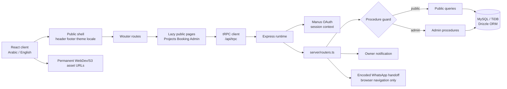

# Glloria architecture

## Runtime shape

The application is a Vite-built React client served by the Express entry point from the managed WebDev runtime. The browser uses the tRPC client under `/api/trpc`; procedures are the typed boundary between the UI and the server. Wouter owns public route matching, while the heavier public pages and admin page are lazy-loaded behind a shared `Suspense` loader.

## Frontend responsibilities

`client/src/App.tsx` defines the public shell, route map, lazy boundaries, theme provider, locale provider, and fixed WhatsApp contact affordance. `LocaleContext` supplies translations and the document direction; Arabic uses RTL and English uses LTR. `ThemeContext` persists the light/dark selection. `RevealObserver` is deliberately scoped to public sections, excludes admin surfaces, honors `prefers-reduced-motion`, and uses a layout-safe setup before the first paint.

The public visual language is implemented in `client/src/index.css`. The base system uses ivory, charcoal, terracotta, olive, thin rules, asymmetric columns, and generous whitespace. Public buttons, booking/contact panels, social sharing, and project cards are treated as editorial links and image compositions rather than a dense collection of filled rectangles. The admin console intentionally retains structured surfaces because it is an operational tool rather than the public brand experience.

## Server and authorization

`server/_core/context.ts` resolves the current Manus OAuth session. `publicProcedure` is used for published project and testimonial reads and consultation creation. `adminProcedure` requires a session and `ctx.user.role === "admin"`; authorization is therefore enforced at the tRPC boundary instead of relying on hidden UI controls. The owner is promoted through the existing user upsert path when the configured owner OpenID matches.

| Procedure family | Public behavior | Admin behavior |
|---|---|---|
| `consultations` | `create` validates the request, rejects the honeypot, persists the request, and attempts owner notification | `list`, `get`, `stats`, `update`, and `export` expose booking operations and status lifecycle |
| `projects` | `list` and `bySlug` return published projects only, optionally filtered by design type | `adminList`, `create`, `update`, and `delete` manage content and draft visibility |
| `testimonials` | `list` returns only approved + consented + verified records | `adminList` and mutations manage real customer stories; publication is rejected without consent and verification |
| `analytics` | Not exposed publicly | `overview` returns protected monthly booking/project timelines with empty-period buckets |

## Data model

The schema in `drizzle/schema.ts` contains `users`, `projects`, `testimonials`, and `consultation_requests`. Project and testimonial rows retain `ownerId`; consultation requests retain optional ownership, lifecycle status, admin notes, and last-editor metadata. Search and status fields have indexes for the admin booking workflow.

The booking form is a five-step bilingual wizard. It collects full name, phone, optional email, city, property type, area, requested service, budget, optional aesthetic preference, preferred date and time, project description, privacy consent, and a honeypot field. The server validates format and length with Zod before persistence; the optional aesthetic preference is stored in `consultation_requests.aestheticPreference` and remains inside the protected admin detail/CSV workflow. The follow-up WhatsApp URL is generated in the browser with an encoded confirmation message; this is a handoff to WhatsApp, not a server-side automatic message sent from the business account.

## Content and storage boundaries

Original project assets are uploaded to permanent WebDev storage and referenced through `/manus-storage/...` URLs. The repository contains no image bytes. Gallery JSON is parsed and sorted by `shared/gallery.ts`; the public detail route now fails closed when its published managed query returns no record, so an unavailable or unknown slug cannot display a legacy reference gallery.

The approved public labels are **Private Residence** and **Boska Café & Restaurant**, with executed-project provenance. Where a city, year, area, client name, or service scope has not been supplied, the UI leaves it absent rather than creating a marketing claim. Optional case-study fields (`challenge`, `concept`, `materials`, `palette`, `serviceScope`, before/after image metadata) are nullable and render only when `caseStudyApproved` is true and content is present. The public testimonials section remains hidden while there are no approved real stories; when approved stories exist, the carousel renders only the verified, consented records returned by the public procedure. The Contact page shows the approved high-level location label `Qena, Egypt` without exposing an unverified street address.

## Change workflow

For UI changes, update the relevant page/component and `client/src/index.css`, then run `pnpm test`, `pnpm check`, and `pnpm build`. For schema changes, update `drizzle/schema.ts`, generate the migration, review the SQL, and apply it through the managed database workflow. Keep public and admin data boundaries explicit in both the router and query helper.

For content changes, use the protected admin workflow and preserve provenance and consent. Do not seed customer testimonials, ratings, bookings, or other user-generated content. Keep asset uploads outside the repository and use permanent storage references. Save a WebDev checkpoint only after `todo.md` has been reviewed and all implemented items are checked.
